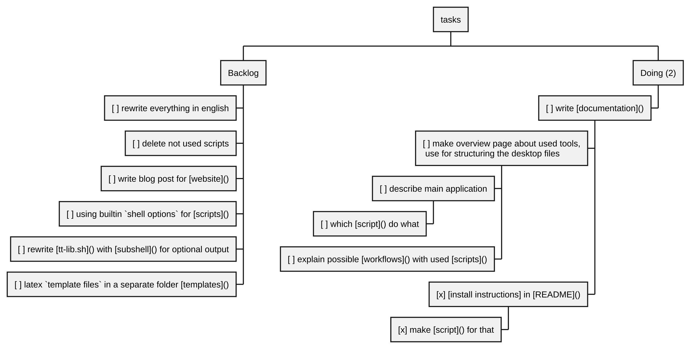

# Changelog-Journal



*kanboard.plantuml*


Redirecting output from a function block to a file in Linux | AnonymousOverflow  
https://ao.ngn.tf/questions/18095152/redirecting-output-from-a-function-block-to-a-file-in-linux
Bash-Scripting mit Optionen und Parametern  
https://www.dev-insider.de/bash-scripting-mit-optionen-und-parametern-a-4af6b57c5165b887f8386ae1fbaa7efe/
Adding arguments and options to your Bash scripts  
https://www.redhat.com/en/blog/arguments-options-bash-scripts

### 2025-03-04
  - [x] [tt] with real path of file not the terminal path, `realpath` \n program not working, using the real path of the [.desktop] file with `tt $f`

### 2025-02-25
  - [x] make [website] 
  - [x] insert in [scripts] the `author` variable from [config file]
   - [x] insert in [example-config]
### 2025-02-17
- [x] use websession for [tabs2topics] like in [save-websession.sh] 
	- [x] apply to new note with tabs
- [x] save and open web session with [zim-firefox-session]
	- [x] [script] for save a web session in a [markdown file] 
	- [x] rewrite [zim-firefox-session] for opening saved sessions from file, not selection
	- [x] option for copied and a file
	- [x] renamed [zim-firefox-session] to [open-websession]
	- [x] make a [.desktop file] for using in dolphin 

### 2025-02-16
- [x] [zim-insert-picture] combined with [zim-insert-sketch]
- [x] [zim-dot-create] and [zim-dot-update] deleted, because [insert-code] in combination with [noweb.py] makes it easier to handle diagrams
- [x] combined [ttd] with [zim-dir-txt.sh] 
- [x] rewrite [topic2zim.sh]
	- [x] rename [topic2zim.sh] to [tabs2topic.sh]
- [x] rename [tabs2zim.sh] to [tabs2today.sh]
- [x] integrate plotting in [zim] and or [markdown] with [noweb.py] and [gnuplot]
- [x] integrate mermaid diagrams
- [x] combined [zim-insert-plantuml.sh] with [insert-code.sh]

Plotting - Tutorial
https://doc.sagemath.org/html/en/tutorial/tour_plotting.html
SageMath: saving picture of graph to a file | AnonymousOverflow
https://overflow.adminforge.de/questions/70979154/sagemath-saving-picture-of-graph-to-a-file
Coding in Python for Sage - Developer Guide
https://doc.sagemath.org/html/en/developer/coding_in_python.html
Tutorial: Programming in Python and Sage - Thematic Tutorials
https://doc.sagemath.org/html/en/thematic_tutorials/tutorial-programming-python.html

### 2025-02-12
- [x] no rewrite of [ttdm], deleted
- [x] remake latex template for Apply in [template-apply.sh]
- [x] rewrite [zim-template-calculation.sh] with [tt-lib.sh]
- [x] combined request of language name of [template-tex.sh], [template-calculation.sh] and [zim-template-calculation.sh]
- [x] [template-tex.sh] and [template-calculation.sh] using the same functions of [tt-lib.sh]
- [x] combine `ttex` function with [template-tex.sh] script, using the same template in [tt-lib.sh]
- [x] integrate markdown template in [template-calculation.sh] script

### 2025-02-09 Draft of html to markdown

Procedure
- using a [download tool] for saving a website in a [zip] file
- then extract
- then convert [html] to [markdown]
- then have a folder with the original version and a annotated version of the website

GitHub - opengovsg/pdf2md: A PDF to Markdown converter
https://github.com/opengovsg/pdf2md
GitHub - suntong/html2md: HTML to Markdown converter
https://github.com/suntong/html2md
GitHub - opendatalab/MinerU: A high-quality tool for convert PDF to Markdown and JSON.一站式开源高质量数据提取工具，将PDF转换成Markdown和JSON格式。
https://github.com/opendatalab/MinerU


### 2025-02-08
- [x] combine [tt-change] with [ttc]
	- [x] also change video files with subtitles

GitHub - Osndok/zim-plugin-append: Makes adding text to Zim pages from the command line (or another unix process) possible without further user interaction.
https://github.com/Osndok/zim-plugin-append

### 2025-02-07
- [x] [Download-Video.sh] make possible for downloading from other websites then [youtube], but sites like arte tv not working correctly, using mediatekview
- [x] change variables name to more understandable names in config file
- [x] rename [Download-Video-Select.sh] to [Download-Video.sh]

### 2025-02-06
- [x] [ttvidc] deleted, not used

### 2025-02-05
- [x] rename [ttrename] in [tt-change] and working with folders
- [x] combine [ttrename] with [tti] and renamed to [tt-change]
- [x] replace `zenity` with `yad`
- [x] create example [.desktop] files in the [repo] and home with [noweb.py] file format
	- [x] new folder
	- [x] all used [.desktop] files in [repo] with link to service folder
- [x] deleted [ttnc] not used
	- [x] -> rename [ttncc] to [ttc]
	- [x] -> insert [ttc] in [ttrename]

### 2025-02-04
- [x] position of picture in `ttpic` above text
- [x] rewrite [ttm] and [ttncc]
- [x] rewrite [ttd] with the [tt] script
- [x] logging in the [.desktop] files enabled, in folder `~/.config/tt/`

Writing errors and output to a text file and Console | AnonymousOverflow
https://overflow.adminforge.de/questions/3008545/writing-errors-and-output-to-a-text-file-and-console

### 2025-02-03
- [x] option for [tt] execute without `yad` request
- [x] all `video` related scripts are connected via `ttvid` function
- [x] move files to folder, but for `pictures` and `music` not.
	- [x] `pdf` files
	- [x] `tex` files
	- [x] `video` files
	- [x] other files

### 2025-02-02 tt-lib.sh
- [x] connect programs with [libraries], [tt-lib.sh]
	- [x] shell library for cleaning filenames
	- [x] shell library for markdown template
	- [x] shell library for [zim] template
	- [x] template function for nodes for files and usable with [library] inclusion
	- [x] `ttpdf` function
	- [x] `ttvid` function

Use config file for my shell script | AnonymousOverflow
https://overflow.adminforge.de/exchange/unix/questions/175648/use-config-file-for-my-shell-script#331965
### 2025-02-01
- [x] publish on [github]
- [x] moved all [scripts] to [Scripts] folder
- [x] using a [config file] for the path and variables
	- [x] create config dir
	- [x] set `standard variables`
	- [x] script for reading config file
	- [x] rewrite programs for `standard variables`

### 2024-08-08 template tex
- [x] [template-tex]
	- [x] template for [Rechnung]
	- [x] template for [Bewerbung]

### 2024-02-13 combined scripts tts und ttn

### ttvidc corrected to markdown
[ttvidc] corrected to markdown and you can choose both files

### 2023-10-30 tex support in ttn and tts

### 2023-10-29 created programms `template-tex.sh` and `texstudio-noweb-py.sh`
created program `template-tex.sh` like `template-calculation`
`texstudio` behavior for markdown files with `noweb`, compilation and so on changed with script [texstudio-noweb-py.sh](texstudio-noweb-py.sh)

### 2023-07-03 wayland paste in zim
custom tool for insert clipboard of [wayland]

### 2023-06-25 open-file template-program and template-calculation
Combination of `template-program` and `zim-template-program`.
Custom tool for open file in `zim`.
Creation of `template-calculation` and `zim-template-calculation`.

### 2023-06-22 Insert date later and open folder zim
Custom tool [zim-date-later]() for insert `<2277-11-11` date for read later function
Custom tool for open in [zim] the folder of the containing file.

### 2023-06-21 Zim Quoting
The program [zim-quoting-copy]() can copy a marked line. The marked line gets an anchor. The copied text can be pasted at the desired position of pages.

### 2023-05-25 Kanboardlist and Dateheadlines
[kanboardlist.md](kanboardlist.md) insert Kanboardlists in `zim-wiki`
[zim-dateheadlines.md](zim-dateheadlines.md) insert date headlines in `zim-wiki`

### create kanboard

*run-cell.sh*
```bash
###*website preview}}
noweb.py -Rkanboard.plantuml CHANGELOG-JOURNAL.md > CHANGELOG-JOURNAL/kanboard.plantuml && plantuml CHANGELOG-JOURNAL/kanboard.plantuml && echo 'kanboard.plantuml' && date && gwenview CHANGELOG-JOURNAL/kanboard.png 2>/dev/null 
```

*website preview*
```bash
python3 -m http.server 3000
```

